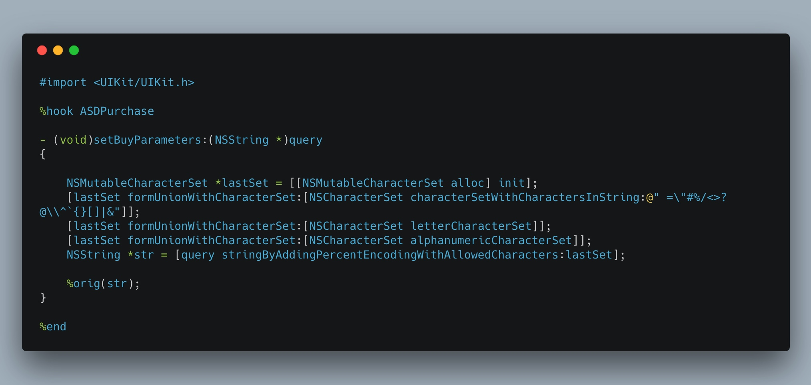

# fix app admin crash at iOS 11

如何安装应用降级[App_Admin_Cydia_tweak](https://yalujailbreak.net/app-admin/#Download_App_Admin_Cydia_tweak)

[不看文章直接安装deb](Packages/com.app.test.Test-appstore-admin_0.1-1_iphoneos-arm.deb)

在 iOS 11 使用 App Admin 每次点击下载后都闪退，但是 google 一些国外的文章都说是好用的，很捉急。原本也不着急解决，但是最近需要老版本来验证点东西，没办法，就写了一个 tweak 修复这个 bug 。

查看日志记录是崩溃在这里:

```
Last Exception Backtrace:
0   CoreFoundation                	0x181796d8c __exceptionPreprocess + 228
1   libobjc.A.dylib               	0x1809505ec objc_exception_throw + 55
2   CoreFoundation                	0x181796c6c +[NSException raise:format:] + 115
3   Foundation                    	0x182203104 -[__NSConcreteURLComponents setPercentEncodedQuery:] + 131
4   AppStoreDaemon                	0x196bfbff8 -[ASDPurchase setBuyParameters:] + 87
5   AppStoreKit                   	0x10539f820 0x1051c4000 + 1947680
6   AppStoreKit                   	0x1052a0160 0x1051c4000 + 901472
7   AppStoreKit                   	0x10529b17c 0x1051c4000 + 881020
8   uaupdatetools.dylib           	0x10680a9e0 0x106800000 + 43488
9   uaupdatetools.dylib           	0x10680ef98 0x106800000 + 61336
10  uaupdatetools.dylib           	0x106805c50 0x106800000 + 23632
11  uaupdatetools.dylib           	0x106805be8 0x106800000 + 23528
12  UIKit                         	0x18b66ff10 -[UITableView _selectRowAtIndexPath:animated:scrollPosition:notifyDelegate:] + 1355
13  UIKit                         	0x18b6c3b94 -[UITableView _userSelectRowAtPendingSelectionIndexPath:] + 267
```
复现流程是：打开 App Store ，搜索中文 app 名字，进入详情页面，然后使用降级下载，在点击旧版本下载后，App Store 就会发生闪退。

原先碰到过这种崩溃，是设置 NSURLComponents 的时候有不符合标准的 url 字符，通过打印 buyParameters 查看里面确实有汉字，导致崩溃，所以在源头上对汉字做一下 urlencode




